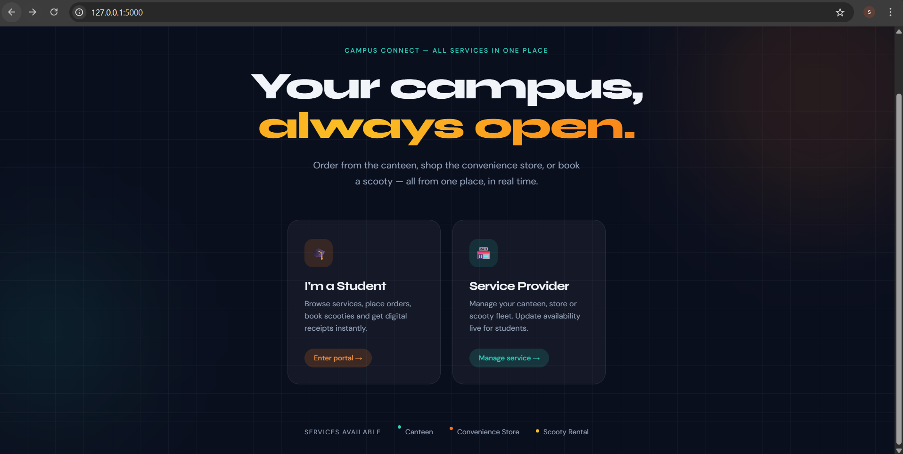
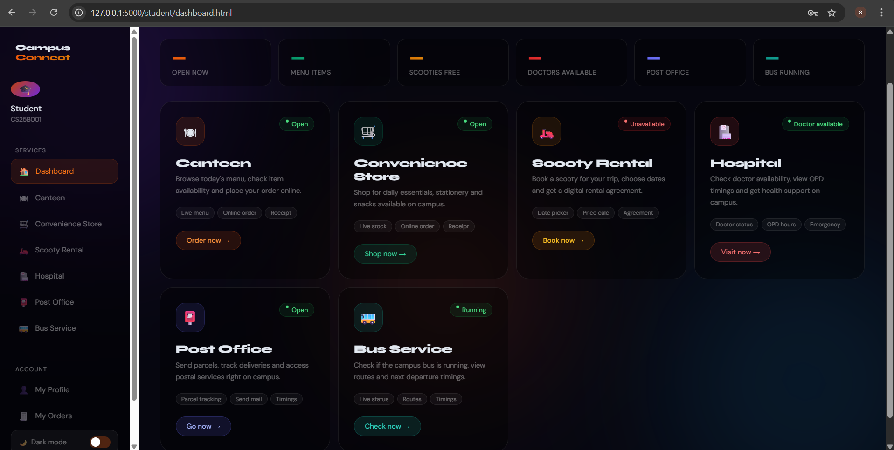
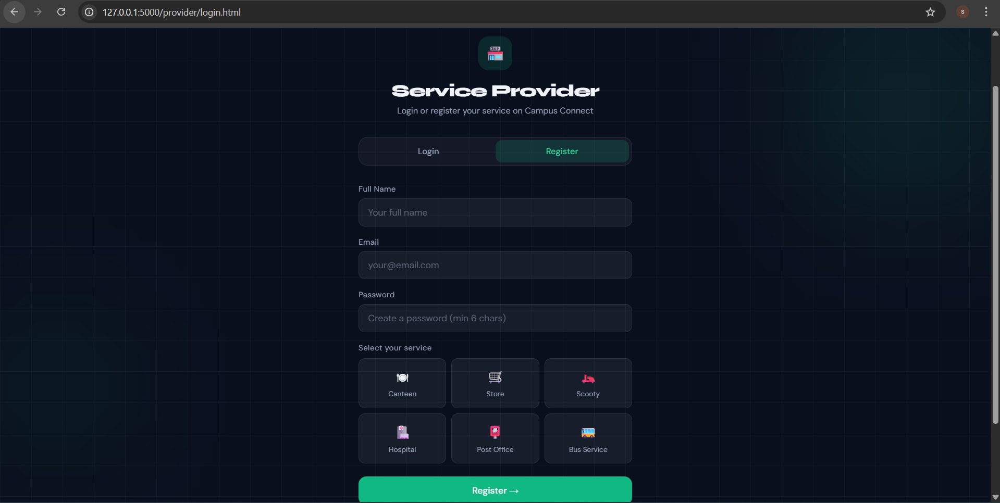
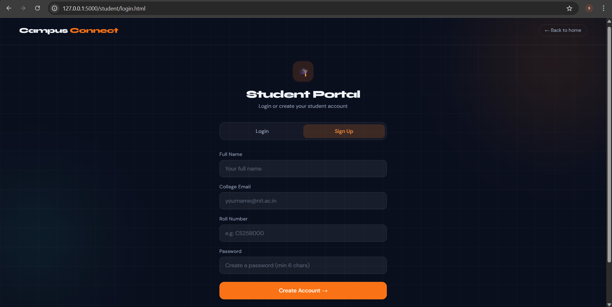

# 🎓 Campus Connect

A centralized campus service platform that connects students with essential college services like canteen, store, rentals, and more — all in one place.

---

## 🚀 Problem

Students often struggle to access campus services efficiently due to lack of a unified system. Managing orders, rentals, and service availability becomes inconvenient and time-consuming.

---

## 💡 Solution

Campus Connect provides a single web platform where:

* Students can access multiple campus services easily
* Service providers can manage their offerings efficiently
* All interactions happen digitally and transparently

---

## ✨ Features

### 👨‍🎓 Student Portal

* User signup and login
* Browse and order food from canteen
* Shop essentials from convenience store
* Book scooty rentals with digital agreement
* Check hospital/doctor availability
* Access post office and bus service info

### 🧑‍💼 Service Provider Portal

* Login/signup for service providers
* Manage inventory and service status
* Handle orders and bookings
* Track usage and service activity

---

## 🛠 Tech Stack

* **Backend:** Python (Flask)
* **Database:** SQLite (SQLAlchemy)
* **Frontend:** HTML, CSS, JavaScript

---

## ⚙️ Setup Instructions

1. Install Python 3.x
   https://www.python.org/

2. Clone the repository:

```
git clone <https://github.com/sehdi-giidii/Campus-connect.gitt>
```

3. Navigate to project folder:

```
cd Campus-Connect
```

4. Install dependencies:

```
pip install -r requirements.txt
```

5. Run the application:

```
python app.py
```

6. Open in browser:

```
http://127.0.0.1:5000
```

## 📁 Project Structure
- `app.py`: Main entry point of the application.
- `models/`: Contains SQLAlchemy database schemas.
- `routes/`: Flask blueprints for handling different portals.
- `static/`: HTML, CSS, JavaScript, and Image assets.
- `requirements.txt`: List of Python packages required.

---

## 🧪 How to Test

### Student Flow

* Click **Student Portal** on homepage
* Sign up using any email and password
* Explore services like Canteen, Store, Scooty Rental

### Service Provider Flow

* Click **Service Provider Portal**
* Sign up and choose a service
* Login to manage services

---

---

## 👥 Team

* Team Remodata

---

## 📌 Notes

* This project is a prototype developed for an ideathon
* Designed to demonstrate concept, workflow, and usability
* Some features are incomplete 
---

## 📸 Screenshots

### 🏠 Homepage


### 🎓 Student Dashboard


### 🎓 service provider sign up page


### 🎓 student signup page

